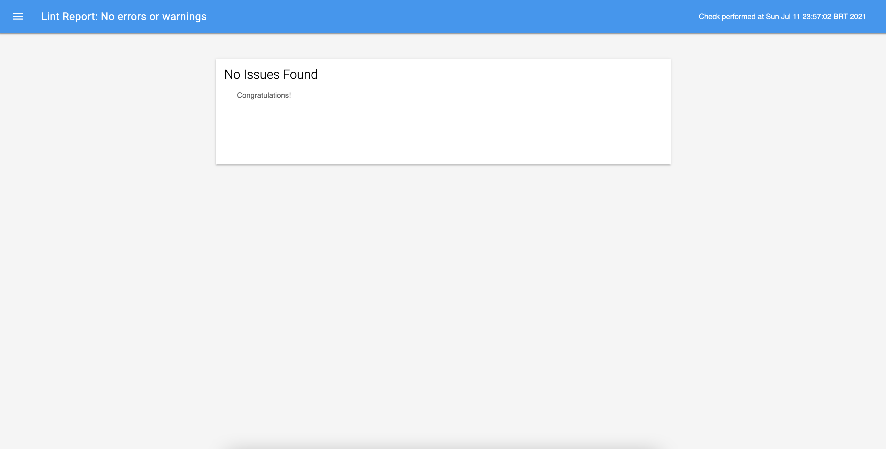
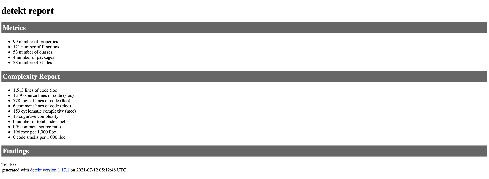

# The Show Hub
Travis CI Status:

## What is this?
The Show Hub is a simple Android app developed for a technical interview challenge.

### Challenge Description
- Create a simple Android app with an initial screen showing a button which when pressed initiates presenting a new screen which requests a list of tv shows and presents them to the user.
- Produce clean and well formatted/documented code following appropriate coding standards depending on the platform you choose.
- Send a request to the movie api database and parse the list of tv shows.
- For each of the tv shows returned by the API a set of data will be returned, use the following two fields to populate the list: `name`  (the name of the tv show) and `poster_path` (an image url for the given tv show). Note the api only returns a path of the image url e.g `/nMhv6jG5dtLdW7rgguYWvpbk0YN.jpg`, in order to create a full url to request the image you must set the base url as the following `https://image.tmdb.org/t/p/w500/` so the URL for the image would be: `https://image.tmdb.org/t/p/w500/nMhv6jG5dtLdW7rgguYWvpbk0YN.jpg`
- You should use a RecyclerView for displaying the list of tv shows.
- Add a button to the screen that will allow the user to sort pressed. The user should have a few different options when it comes to sorting, e.g alphabetically, chronologically etc.
- Bonus points will be given to any extra features implemented.

## How to run :running: 
There's nothing unusual in the project setup when compared to any other simples apps, so you can just click on :arrow_forward: in Android Studio.

## Project Overview :triangular_ruler:

### Design

The layout of the solution was slightly inspired by [this amazing dribbble concept](https://dribbble.com/shots/15279034-Abda-Full-Screen-App/attachments/7032023?mode=media) by Malik Abimany. Unfortunately, I wasn't able to reproduce it entirely due to API info limitations.

  
### Tech Stack

**Programming Language**: 
- Kotlin

**Kotlin 1st Party dependencies**:
- Coroutines

**Android 1st Party dependencies**:
- Jetpack ViewModel
- Jetpack LiveData

**3rd Party Dependencies**:
- Retrofit
- Okhttp
- Glide
- Koin

**Test Dependencies**:
- Mockk
- JUnit 5
- Espresso

### Coding

**Architectural Pattern**: 
- MVVM (Model-View-ViewModel)

**Approaches**:
- SOLID
- Clean Code by Uncle Bob
- Clean Architecture by Uncle Bob

**Design patterns**:
- Adapter
- Anti Corruption Layer Pattern
- Observer Pattern
- Repository Pattern
- Result Pattern

**Test patterns**:
- Robot Pattern

## Quality Assurance Overview :mag:

This project counts with two automated tests layers: ***Unit Test*** and ***Instrumentation Test***.

Also, all tests are passing in a ***Travis CI*** pipeline.

### Android Lint Report

There's no android lint issues for this project!

### Detekt Report

There's no detekt issues either :)

## If I had more time...

It would be awesome to explore more details about **The Movie Api** and perhaps include more features like *Searching*, *Pagination* or even a *Watch List*. 