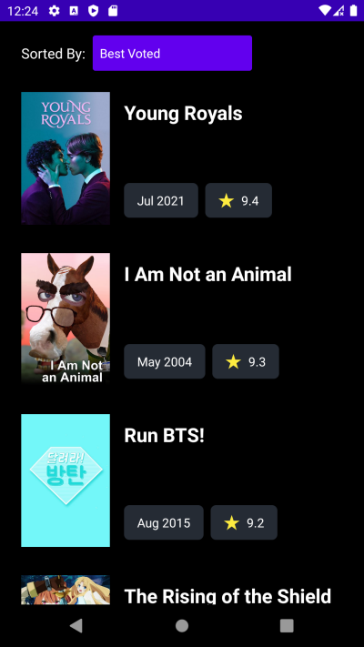

# The Show Hub
Travis CI Status:

## What is this?
The Show Hub is a simple Android app developed for a technical interview challenge.

### Challenge Description
- Create a simple Android app with an initial screen showing a button which when pressed initiates presenting a new screen which requests a list of tv shows and presents them to the user.
- Produce clean and well formatted/documented code following appropriate coding standards depending on the platform you choose.
- Send a request to the movie api database and parse the list of tv shows.
- For each of the tv shows returned by the API a set of data will be returned, use the following two fields to populate the list: `name`  (the name of the tv show) and `poster_path` (an image url for the given tv show). Note the api only returns a path of the image url e.g `/nMhv6jG5dtLdW7rgguYWvpbk0YN.jpg`, in order to create a full url to request the image you must set the base url as the following `https://image.tmdb.org/t/p/w500/` so the URL for the image would be: `https://image.tmdb.org/t/p/w500/nMhv6jG5dtLdW7rgguYWvpbk0YN.jpg`
- You should use a RecyclerView for displaying the list of tv shows.
- Add a button to the screen that will allow the user to sort pressed. The user should have a few different options when it comes to sorting, e.g alphabetically, chronologically etc.
- Bonus points will be given to any extra features implemented.

## How to run :running: 
There's nothing unusual in the project setup when compared to any other simples apps, so you can just click on :arrow_forward: in Android Studio.

## Project Overview :triangular_ruler:

### Design

The layout of the solution was slightly inspired by [Malik Abimany's dribbble concept](https://dribbble.com/shots/15279034-Abda-Full-Screen-App/attachments/7032023?mode=media). Unfortunately, I wasn't able to reproduce it entirely due to API data limitations.

  
### Tech Stack

**Programming Language**: 
- Kotlin

**Kotlin 1st Party dependencies**:
- [Coroutines](https://developer.android.com/kotlin/coroutines)

**Android 1st Party dependencies**:
- [Jetpack ViewModel](https://developer.android.com/topic/libraries/architecture/viewmodel)
- [Jetpack LiveData](https://developer.android.com/topic/libraries/architecture/livedata)

**3rd Party Dependencies**:
- [Retrofit](https://github.com/square/retrofit)
- [Okhttp](https://square.github.io/okhttp/)
- [Glide](https://bumptech.github.io/glide/)
- [Koin](https://insert-koin.io/)

**Test Dependencies**:
- [Mockk](https://mockk.io/)
- [JUnit 5](https://junit.org/junit5/)
- [Espresso](https://developer.android.com/training/testing/espresso)

### Coding

**Architectural Pattern**: 
- [MVVM (Model-View-ViewModel)](https://developer.android.com/jetpack/guide)

**Approaches**:
- [SOLID](https://en.wikipedia.org/wiki/SOLID)
- [Clean Code by Uncle Bob](https://www.cleancoders.com/)
- [Clean Architecture by Uncle Bob](https://www.cleancoders.com/)

**Design patterns**:
- [Adapter](https://refactoring.guru/design-patterns/adapter)
- [Anti Corruption Layer Pattern](https://docs.microsoft.com/en-us/azure/architecture/patterns/anti-corruption-layer)
- [Observer Pattern](https://refactoring.guru/design-patterns/observer)
- [Repository Pattern](https://martinfowler.com/eaaCatalog/repository.html)
- [Result Pattern](https://medium.com/@cummingsi1993/the-operation-result-pattern-a-simple-guide-fe10ff959080)

**Test patterns**:
- [Robot Pattern/Page Object Pattern](https://martinfowler.com/bliki/PageObject.html)

## Quality Assurance Overview :mag:

This project counts with two automated tests layers: ***Unit Test*** and ***Instrumentation Test***. They are covering all behaviors of the solution.

### Continuous Integration

This repository is linked to a ***[Travis CI](https://travis-ci.com/)*** pipeline:

**Pipeline steps**:
1. Build
2. Android Lint
3. [Detekt](https://detekt.github.io/detekt/) Lint
4. Unit Tests
5. Instrumented Tests 

### Android Lint Report

There's no android lint issues for this project!

### Detekt Report

There's no [detekt](https://detekt.github.io/detekt/) issues either :)

## If I had more time...

It would be awesome to explore more details about **The Movie Api** and perhaps include more features like *Searching*, *Pagination* or even a *Watch List*. 